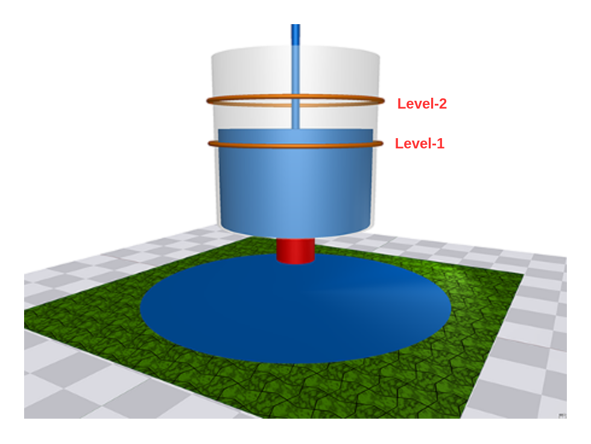
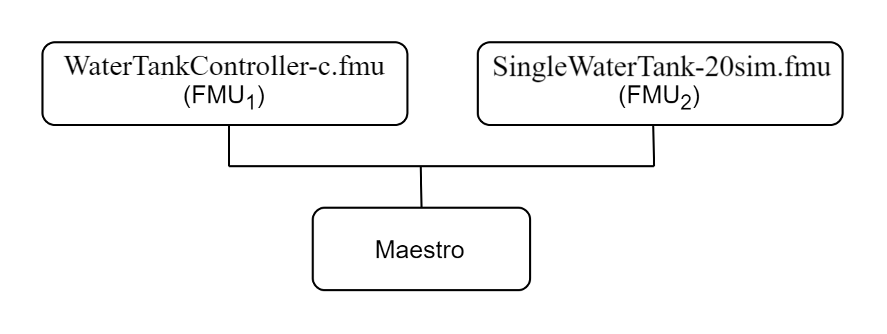

# Water Tank Fault Injection

## Overview

This example shows a fault injection (FI) enabled digital twin (DT).
A live DT is subjected to simulated faults received from the environment.
The simulated faults is specified as part of DT configuration and can be
changed for new instances of DTs.

In this co-simulation based DT, a watertank case-study is used; co-simulation
consists of a tank and controller. The goal of which is to keep
the level of water in the tank between ```Level-1``` and ```Level-2```.
The faults are injected into output of the water tank
controller (**Watertankcontroller-c.fmu**)
from 12 to 20 time units, such that
the tank output is closed for a period of time, leading to the water level
increasing in the tank beyond the desired level (```Level-2```).

## Example Diagram



## Example Structure



## Configuration of assets

This example uses two models and one tool.
The specific assets used are:

| Asset Type | Names of Assets | Visibility | Reuse in Other Examples |
|:---|:---|:---|:---|
| Models | watertankcontroller-c.fmu | Private | Yes |
|  | singlewatertank-20sim.fmu | Private | Yes |
| Tool | maestro-2.3.0-jar-with-dependencies.jar | Common | Yes |

The `multimodelFI.json` and `simulation-config.json`
are two DT configuration files used for executing the digital twin.

:fontawesome-solid-circle-info: The faults are defined in **wt_fault.xml**.

## Lifecycle Phases

| Lifecycle Phase    | Completed Tasks |
| -------- | ------- |
| Create  | Installs Java Development Kit for Maestro tool    |
| Execute | Produces and stores output in data/water_tank_FI/output directory|
| Clean   | Clears run logs and outputs |

## Run the example

To run the example, change your present directory.

```bash
cd workspace/examples/digital_twins/water_tank_FI
```

If required, change the execute permission of lifecycle scripts
you need to execute, for example:

```bash
chmod +x lifecycle/create
```

Now, run the following scripts:

### Create

Installs Open Java Development Kit 17 and pip dependencies.
The pandas and matplotlib are the pip dependencies installated.

```bash
lifecycle/create
```

### Execute

Run the co-simulation. Generates the co-simulation output.csv file
at `/workspace/examples/data/water_tank_FI/output`.

```bash
lifecycle/execute
```

### Analyze phase

Process the output of co-simulation to produce a plot at:
`/workspace/examples/data/water_tank_FI/output/plots/`.

```bash
lifecycle/analyze
```

#### Examine the results

The results can be found in the
_workspace/examples/data/water_tank_FI/output directory_.

You can also view run logs in the
_workspace/examples/digital_twins/water_tank_FI_.

### Terminate phase

Clean up the temporary files and delete output plot

```bash
lifecycle/terminate
```

## References

More details on this case-study can be found in the paper:

```M. Frasheri, C. Thule, H. D. Macedo, K. Lausdahl, P. G. Larsen and
L. Esterle, "Fault Injecting Co-simulations for Safety,"
2021 5th International Conference on System Reliability and Safety (ICSRS),
Palermo, Italy, 2021.```
