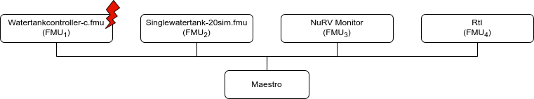
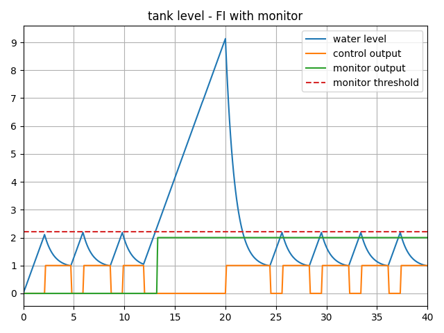

# Water Tank Fault Injection with NuRV Runtime Monitor

## Overview

This example shows a fault injection (FI) enabled digital twin (DT).
A live DT is subjected to simulated faults received from the environment.
The simulated faults is specified as part of DT configuration and can be
changed for new instances of DTs.
This version of the example is expanded with a monitor generated by NuRV.
More information about NuRV is available [here](https://es-static.fbk.eu/tools/nurv/).

In this co-simulation based DT, a watertank case-study is used; co-simulation
consists of a tank and controller. The goal of which is to keep
the level of water in the tank between ```Level-1``` and ```Level-2```.
The faults are injected into output of the water tank
controller (__Watertankcontroller-c.fmu__)
from 12 to 20 time units, such that
the tank output is closed for a period of time, leading to the water level
increasing in the tank beyond the desired level (```Level-2```).
Additionally, a monitor is inserted in the simulation to check at runtime
whether the level of the water stays below a maximum threshold.

## Example Diagram


## Example Structure



## Digital Twin Configuration

This example uses two models and one tool.
The specific assets used are:

| Asset Type | Names of Assets | Visibility | Reuse in Other Examples |
|:---|:---|:---|:---|
| Models | watertankcontroller-c.fmu | Private | Yes |
|        | singlewatertank-20sim.fmu | Private | Yes |
|        | m1.fmu                    | Private | No  |
|        | RtI.fmu                   | Private | Yes |
| Specification | m1.smv | Private | No |
| Tool | maestro-2.3.0-jar-with-dependencies.jar | Common | Yes |

The `multimodelFI.json` and `simulation-config.json`
are two DT configuration files used for executing the digital twin.
You can change these two files to customize the DT to your needs.

:fontawesome-solid-circle-info: The faults are defined in __wt_fault.xml__.

## Lifecycle Phases

| Lifecycle Phase    | Completed Tasks |
| -------- | ------- |
| Create  | Installs Java Development Kit for Maestro tool<br>Generates and compiles the monitor FMU    |
| Execute | Produces and stores output in data/water_tank_FI_monitor/output directory|
| Clean   | Clears run logs and outputs |

## Run the example

To run the example, change your present directory.

```bash
cd /workspace/examples/digital_twins/water_tank_FI_monitor
```

If required, change the execute permission of lifecycle scripts
you need to execute, for example:

```bash
chmod +x lifecycle/create
```

Now, run the following scripts:

### Create

Installs Open Java Development Kit 17 and pip dependencies.
The pandas and matplotlib are the pip dependencies installated.
The monitor FMU from the NuRV specification is generated and compiled.

```bash
lifecycle/create
```

### Execute

Run the co-simulation. Generates the co-simulation output.csv file
at `/workspace/examples/data/water_tank_FI_monitor/output`.

```bash
lifecycle/execute
```

### Analyze phase

Process the output of co-simulation to produce a plot at:
`/workspace/examples/data/water_tank_FI_monitor/output/plots/`.

```bash
lifecycle/analyze
```

A sample plot is given here.



In the plot, four color-coded indicators are used to represent different
values. The blue line shows the water tank level, while orange represents
the control output and green indicates the monitor's verdict. A red dashed
line serves as a reference point, marking the level checked by the
monitor. As the water level exceeds this threshold, the monitor's verdict
changes from `unknown` (`0`) to `false` (`2`).

#### Examine the results

The results can be found in the
_/workspace/examples/data/water_tank_FI_monitor/output directory_.

You can also view run logs in the
_/workspace/examples/digital_twins/water_tank_FI_monitor_.

### Terminate phase

Clean up the temporary files and delete output plot

```bash
lifecycle/terminate
```

## References

More details on this case-study can be found in the paper:

```txt
M. Frasheri, C. Thule, H. D. Macedo, K. Lausdahl, P. G. Larsen and
L. Esterle, "Fault Injecting Co-simulations for Safety,"
2021 5th International Conference on System Reliability and Safety (ICSRS),
Palermo, Italy, 2021.
```

The fault-injection plugin is an extension to the Maestro co-orchestration
engine that enables injecting inputs and outputs of FMUs in an FMI-based
co-simulation with tampered values.
More details on the plugin can be found in
[fault injection](https://github.com/INTO-CPS-Association/fault-injection-maestro)
git repository. The source code for this example is also in the same github
repository in a
[example directory](https://github.com/INTO-CPS-Association/fault-injection-maestro/blob/development/fi_example/README.md).
