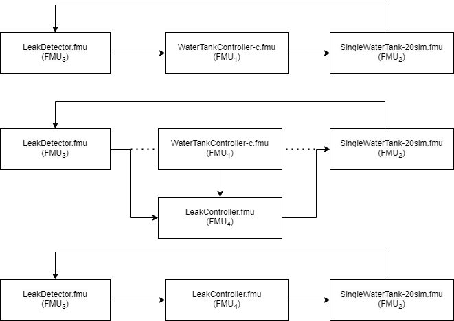

# Water Tank Swap

## Overview

This example is a water-tank model swap experiment for DTaaS. The experiment uses the Maestro co-orchestration engine for FMI-based co-simulation with the Model Swap feature including a FaultInject extension. This demonstrates a Docker-less version of the experiment at https://github.com/lausdahl/fmiSwap for use on the DTaaS platform.

The model swap mechanism demonstrated by the experiment is detailed in the paper "Dynamic Runtime Integration of New Models in Digital Twins" [H. Ejersbo, K. Lausdahl, M. Frasheri, L. Esterle] presented at the [SEAMS 2023 conference](https://conf.researchr.org/home/seams-2023). The water-tank experiment is further detailed here:[Ejersbo, H., Lausdahl, K., Frasheri, M., & Esterle, L. (2023). fmiSwap: Run-time Swapping of Models for Co-simulation and Digital Twins. arXiv preprint arXiv:2304.07328.](https://arxiv.org/abs/2304.07328). 

## Example Diagram



## Example Structure


## Configuration of assets

This example uses four models and one tool. The specific assets used are:

| Asset Type | Names of Assets | Visibility | Reuse in Other Examples |
|:---|:---|:---|:---|
| Models | watertankcontroller-c.fmu | Private | Yes |
|  | singlewatertank-20sim.fmu | Private | Yes |
|  | leak_detector.fmu | Private | Yes |
|  | leak_controller.fmu | Private | Yes |
| Tool | maestro-2.3.0-jar-with-dependencies.jar | Common | Yes |

## Lifecycle Phases

| Lifecycle Phase    | Completed Tasks |
| -------- | ------- |
| Create  | Installs Java Development Kit for Maestro tool    |
| Execute | Produces and stores output in data/water_tank_swap/output directory|
| Clean   | Clears run logs and outputs |

## Run the example

To run the example, change your present directory.

```bash
cd workspace/examples/digital_twins/water_tank_swap
```

If required, change the permission of files you need to execute, for example:

```bash
chmod +x lifecycle/create
```

Now, run the following scripts:

### Create

```bash
lifecycle/create
```

### Execute

```bash
lifecycle/execute
```

## Examine the results

The results can be found in the
_workspace/examples/data/water_tank_swap/output directory_.

You can also view run logs in the
_workspace/examples/digital_twins/water_tank_swap_.
