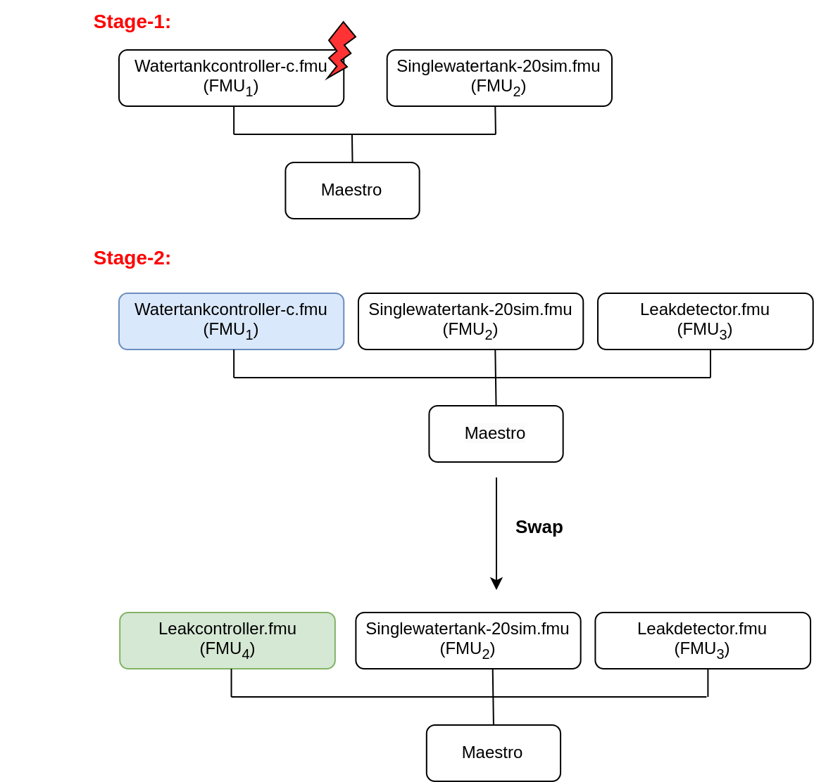

# Water Tank Model Swap

## Overview

This example shows multi-stage execution and dynamic reconfiguration
of a digital twin (DT). Two features of DTs are demonstrated here:

* Fault injection into live DT
* Dynamic auto-reconfiguration of live DT

The co-simulation methodology is used to construct this DT.

## Example Structure



## Configuration of assets

This example uses four models and one tool. The specific assets used are:

| Asset Type | Names of Assets | Visibility | Reuse in Other Examples |
|:---|:---|:---|:---|
| Models | Watertankcontroller-c.fmu | Private | Yes |
|  | Singlewatertank-20sim.fmu | Private | Yes |
|  | Leak_detector.fmu | Private | No |
|  | Leak_controller.fmu | Private | No |
| Tool | maestro-2.3.0-jar-with-dependencies.jar | Common | Yes |

This DT has many configuration files. The DT is executed in two stages.
There exist separate DT configuration files for each stage.
The following table shows the configuration files and their purpose.

| Configuration file name | Execution Stage | Purpose |
|:---|:---|:---|
| mm1. json | stage-1 | DT configuration |
| wt_fault.xml, FaultInject.mabl | stage-1 | faults injected into DT during stage-1 |
| mm2.json | stage-2 | DT configuration |
| simulation-config.json | Both stages | Configuration for specifying DT execution time and output logs |

## Lifecycle Phases

| Lifecycle Phase    | Completed Tasks |
| -------- | ------- |
| Create  | Installs Java Development Kit for Maestro tool    |
| Execute | Produces and stores output in data/water_tank_swap/output directory |
| Analyze | Process the co-simulation output and produce plots |
| Clean   | Clears run logs, outputs and plots |

## Run the example

To run the example, change your present directory.

```bash
cd /workspace/examples/digital_twins/water_tank_swap
```

If required, change the permission of files you need to execute, for example:

```bash
chmod +x lifecycle/create
```

Now, run the following scripts:

### Create

Installs Open Java Development Kit 17 and pip dependencies.
The matplotlib pip package is also installated.

```bash
lifecycle/create
```

### Execute

This DT has two-stage execution. In the first-stage, a co-simulation is
executed. The Watertankcontroller-c.fmu and Singlewatertank-20sim.fmu
models are used to execute the DT.
During this stage, faults are injected into one of the models
(Watertankcontroller-c.fmu) and the system performance is checked.

In the second-stage, another co-simulation is run in which three FMUs
are used. The FMUs used are: watertankcontroller, singlewatertank-20sim,
and leak_detector. There is an in-built monitor in the Maestro tool.
This monitor is enabled during the stage and a swap condition is set
at the beginning of the second-stage.
When the swap condition is satisfied, the Maestro swaps out
Watertankcontroller-c.fmu model and swaps in Leakcontroller.fmu model.
This swapping of FMU models demonstrates the dynamic reconfiguration
of a DT.

The end of execution phase generates the co-simulation output.csv file
at `/workspace/examples/data/water_tank_swap/output`.

```bash
lifecycle/execute
```

### Analyze phase

Process the output of co-simulation to produce a plot at:
`/workspace/examples/data/water_tank_FI/output/plots/`.

```bash
lifecycle/analyze
```

#### Examine the results

The results can be found in the
_workspace/examples/data/water_tank_swap/output directory_.

You can also view run logs in the
_workspace/examples/digital_twins/water_tank_swap_.

### Terminate phase

Clean up the temporary files and delete output plot

```bash
lifecycle/terminate
```

## References

The complete source of this example is available on
[model swap](https://github.com/hejersbo/dtaas-wt-swap) github repository.

The runtime model (FMU) swap mechanism demonstrated by the experiment
is detailed in the paper:

```txt
Ejersbo, Henrik, et al. "fmiSwap: Run-time Swapping of Models for
Co-simulation and Digital Twins." arXiv preprint arXiv:2304.07328 (2023).
```

The runtime reconfiguration of co-simulation by modifying the Functional
Mockup Units (FMUs) used is further detailed in the paper:

```txt
Ejersbo, Henrik, et al. "Dynamic Runtime Integration of
New Models in Digital Twins." 2023 IEEE/ACM 18th Symposium on
Software Engineering for Adaptive and Self-Managing Systems
(SEAMS). IEEE, 2023.
```
