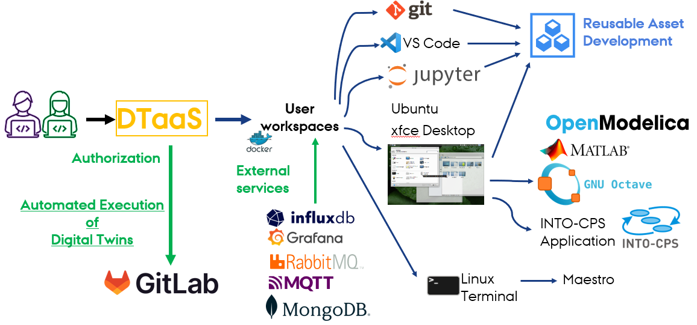

# Overview

## Advantages

The DTaaS software platform provides certain advantages to users:

* Support for different kinds of Digital Twins
  * CFD, Simulink, co-simulation, FEM, ROM, ML etc.
* Integrates with other Digital Twin frameworks
* Facilitate availability of Digital Twin as a Service
* Collaboration and reuse
* Private workspaces for verification
  of reusable assets, trial run DTs
* Cost effectiveness

## Software Features

Each installation of DTaaS platform comes with
the features highlighted in the following picture.

All the users have dedicated workspaces.
These workspaces are dockerized versions of Linux Desktops.
The user desktops are isolated so the installations and
customizations done in one user workspace do not effect the
other user workspaces.

Each user workspace comes with some development tools pre-installed.
These tools are directly accessible from web browser.
The following tools are available at present:

| Tool | Advantage |
|:---|:---|
| Jupyter Lab | Provides flexible creation and use of digital twins and their components from web browser. All the native Jupyterlab usecases are supported here. |
| Jupyter Notebook | Useful for web-based management of their files (library assets) |
| VS Code in the browser | A popular IDE for software development. Users can develop their digital twin-related assets here. |
| ungit | An interactive git client. Users can work with git repositories from web browser |

In addition, users have access to xfce-based remote desktop via VNC client.
The VNC client is available right in the web browser.
The xfce supported desktop software can also be run in their workspace.

The DTaaS software platform has some pre-installed services available.
The currently available services are:

| Service | Advantage |
|:---|:---|
| InfluxDB | Time-series database primarly for storing time-series data from physical twins. The digital twins can use an already existing data. Users can also create visualization dashboards for their digital twins. |
| RabbitMQ | Communication broker for communication between physical and digital twins |
| Grafana | Visualization dashboards for their digital twins. |
| MQTT | Lightweight data transfer broker for IoT devices / physical twins feeding data into digital twins. |

In addition, the workspaces are connected to the Internet so
all the Digital Twins run within their workspace can interact
with both the internal and external services.

The users can publish and reuse the digital twin assets
available on the platform. In addition, users can run their
digital twins and make these live digital twins available as
services to their clients. The clients need not be users of
the DTaaS software installation.
