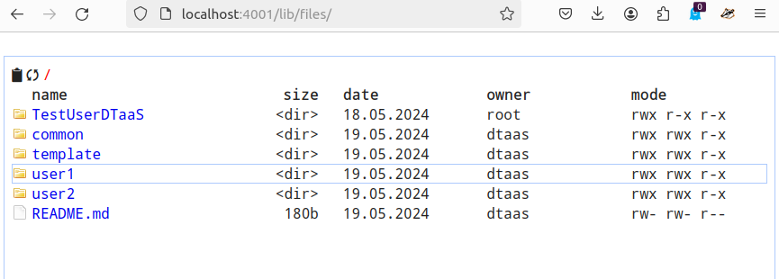

# Library Microservice

The lib microservice is responsible for handling and serving
the contents of library assets of the DTaaS platform.
It provides API endpoints for clients to query, and fetch these assets.

This document provides instructions for using the library microservice.

Please see [assets](assets.md) for a suggested storage
conventions of your library assets.

Once the assets are stored in the library, they become
available in user workspace.

## Application Programming Interface (API)

The lib microservice application provides services at
two end points:

**GraphQL API Endpoint:** `http://foo.com/lib`

**HTTP Endpoint:** `http://foo.com/lib/files`

### HTTP protocol

Endpoint: `localhost:PORT/lib/files`

This option needs to be enabled with `-H http.json` flag.
The regular file upload and download options become available.

Here are sample screenshots.




### GraphQL protocol

Endpoint: `localhost:PORT/lib`

The `http://foo.com/lib` URL opens a graphql playground.

You can check the query schema and try sample queries here.
The graphql queries need to be sent as HTTP POST requests and get responses.

The library microservice services two API calls:

* Provide a list of contents for a directory
* Fetch a file from the available files

The API calls are accepted over GraphQL and HTTP API end points.
The format of the accepted queries are:

### Provide list of contents for a directory

To retrieve a list of files in a directory, use the following GraphQL query.

Replace `path` with the desired directory path.

send requests to: <https://foo.com/lib>

=== "GraphQL Query"

    ``` graphql-query
    query {
      listDirectory(path: "user1") {
        repository {
          tree {
            blobs {
              edges {
                node {
                  name
                  type
                }
              }
            }
            trees {
              edges {
                node {
                  name
                  type
                }
              }
            }
          }
        }
      }
    }

    ```

=== "GraphQL Response"

    ``` graphql-response
    {
      "data": {
        "listDirectory": {
          "repository": {
            "tree": {
              "blobs": {
                "edges": []
              },
              "trees": {
                "edges": [
                  {
                    "node": {
                      "name": "common",
                      "type": "tree"
                    }
                  },
                  {
                    "node": {
                      "name": "data",
                      "type": "tree"
                    }
                  },
                  {
                    "node": {
                      "name": "digital twins",
                      "type": "tree"
                    }
                  },
                  {
                    "node": {
                      "name": "functions",
                      "type": "tree"
                    }
                  },
                  {
                    "node": {
                      "name": "models",
                      "type": "tree"
                    }
                  },
                  {
                    "node": {
                      "name": "tools",
                      "type": "tree"
                    }
                  }
                ]
              }
            }
          }
        }
      }
    }

    ```

=== "HTTP Request"

    ``` http-request
    POST /lib HTTP/1.1
    Host: foo.com
    Content-Type: application/json
    Content-Length: 388

    {
      "query":"query {\n  listDirectory(path: \"user1\") {\n    repository {\n      tree {\n        blobs {\n          edges {\n            node {\n              name\n              type\n            }\n          }\n        }\n        trees {\n          edges {\n            node {\n              name\n              type\n            }\n          }\n        }\n      }\n    }\n  }\n}"
    }

    ```

=== "HTTP Response"

    ``` http-response
    HTTP/1.1 200 OK
    Access-Control-Allow-Origin: *
    Connection: close
    Content-Length: 306
    Content-Type: application/json; charset=utf-8
    Date: Tue, 26 Sep 2023 20:26:49 GMT
    X-Powered-By: Express
    {"data":{"listDirectory":{"repository":{"tree":{"blobs":{"edges":[]},"trees":{"edges":[{"node":{"name":"data","type":"tree"}},{"node":{"name":"digital twins","type":"tree"}},{"node":{"name":"functions","type":"tree"}},{"node":{"name":"models","type":"tree"}},{"node":{"name":"tools","type":"tree"}}]}}}}}}
    ```

### Fetch a file from the available files

This query receives directory path and send the file contents to user in response.

To check this query, create a file `files/user2/data/welcome.txt`
with content of `hello world`.

=== "GraphQL Request"

    ```graphql-request
    query {
      readFile(path: "user2/data/sample.txt") {
        repository {
          blobs {
            nodes {
              name
              rawBlob
              rawTextBlob
            }
          }
        }
      }
    }
    ```

=== "GraphQL Response"

    ```graphql-response
    {
      "data": {
        "readFile": {
          "repository": {
            "blobs": {
              "nodes": [
                {
                  "name": "sample.txt",
                  "rawBlob": "hello world",
                  "rawTextBlob": "hello world"
                }
              ]
            }
          }
        }
      }
    }
    ```

=== "HTTP Request"

    ```http-request
    POST /lib HTTP/1.1
    Host: foo.com
    Content-Type: application/json
    Content-Length: 217
    {
      "query":"query {\n  readFile(path: \"user2/data/welcome.txt\") {\n    repository {\n      blobs {\n        nodes {\n          name\n          rawBlob\n          rawTextBlob\n        }\n      }\n    }\n  }\n}"
    }
    ```

=== "HTTP Response"

    ```http-response
    HTTP/1.1 200 OK
    Access-Control-Allow-Origin: *
    Connection: close
    Content-Length: 134
    Content-Type: application/json; charset=utf-8
    Date: Wed, 27 Sep 2023 09:17:18 GMT
    X-Powered-By: Express
    {"data":{"readFile":{"repository":{"blobs":{"nodes":[{"name":"welcome.txt","rawBlob":"hello world","rawTextBlob":"hello world"}]}}}}}
    ```

The _path_ refers to the file path to look at:
For example, _user1_ looks at files of
**user1**; _user1/functions_ looks at contents of _functions/_ directory.
