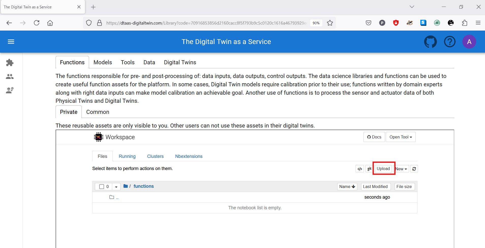

# Reusable Assets

The reusability of digital twin assets makes it easy for
users to work with the digital twins. The reusability of
assets is a fundamental feature of the platform.

## Kinds of Reusable Assets

The DTaaS software categorizes all the reusable library assets into six categories:


### Data

The data sources and sinks available to a digital twins.
Typical examples of data sources are sensor measurements from
Physical Twins, and test data provided by manufacturers for
calibration of models. Typical examples of data sinks are visualization
software, external users and data storage services. There exist special
outputs such as events, and commands which are akin to control outputs
from a Digital Twin. These control outputs usually go to Physical Twins,
but they can also go to another Digital Twin.

### Models

The model assets are used to describe different aspects of Physical Twins
and their environment, at different levels of abstraction. Therefore, it
is possible to have multiple models for the same Physical Twin.
For example, a flexible robot used in a car production plant may have
structural model(s) which will be useful in tracking the wear and tear
of parts. The same robot can have a behavioural model(s) describing the
safety guarantees provided by the robot manufacturer. The same robot
can also have a functional model(s) describing the part manufacturing
capabilities of the robot.

### Tools

The software tool assets are software used to create, evaluate and
analyze models. These tools are executed on top of a computing
platforms, i.e., an operating system, or virtual machines like
Java virtual machine, or inside docker containers.
The tools tend to be platform specific, making them less reusable than models.
A tool can be packaged to run on a local or distributed virtual
machine environments thus allowing selection of most suitable
execution environment for a Digital Twin.
Most models require tools to evaluate them in the context of data inputs.
There exist cases where executable packages are run as binaries
in a computing environment. Each of these packages are a pre-packaged
combination of models and tools put together to create a ready
to use Digital Twins.

### Functions

The functions responsible for pre- and post-processing of:
data inputs, data outputs, control outputs. The data science
libraries and functions can be used to create useful function
assets for the platform.
In some cases, Digital Twin models require calibration prior
to their use; functions written by domain experts along with
right data inputs can make model calibration an achievable goal.
Another use of functions is to process the sensor and actuator
data of both Physical Twins and Digital Twins.

### Digital Twins

These are ready to use digital twins created by one or more users.
These digital twins can be reconfigured later for specific use cases.

## File System Structure

Each user has their assets put into five different
directories named above. In addition, there will also be
common library assets that all users have access to.
A simplified example of the structure is as follows:

```text
workspace/
  data/
    data1/ (ex: sensor)
      filename (ex: sensor.csv)
      README.md
    data2/ (ex: turbine)
      README.md (remote source; no local file)
    ...
  digital_twins/
    digital_twin-1/ (ex: incubator)
      config (yaml and json)
      README.md (usage instructions)
      description.md (short summary of digital twin)
      lifecycle/ (directory containing lifecycle scripts)
    digital_twin-2/ (ex: mass spring damper)
      config (yaml and json)
      README.md (usage instructions)
      description.md (short summary of digital twin)
      lifecycle/ (directory containing lifecycle scripts)
    digital_twin-3/ (ex: model swap)
      config (yaml and json)
      README.md (usage instructions)
      description.md (short summary of digital twin)
      lifecycle/ (directory containing lifecycle scripts)
    ...
  functions/
    function1/ (ex: graphs)
      filename (ex: graphs.py)
      README.md
    function2/ (ex: statistics)
      filename (ex: statistics.py)
      README.md
    ...
  models/
    model1/ (ex: spring)
      filename (ex: spring.fmu)
      README.md
    model2/ (ex: building)
      filename (ex: building.skp)
      README.md
    model3/ (ex: rabbitmq)
      filename (ex: rabbitmq.fmu)
      README.md
    ...
  tools/
    tool1/ (ex: maestro)
      filename (ex: maestro.jar)
      README.md
    ...
  common/
    data/
    functions/
    models/
    tools/
```

!!! tip
    The DTaaS is agnostic to the format of your assets.
    The only requirement is that they are files which can
    be uploaded on the Library page. Any directories can be
    compressed as one file and uploaded. You can decompress
    the file into a directory from a Terminal or xfce Desktop
    available on the Workbench page.

A recommended file system structure for storing assets is also
available in
[DTaaS examples](https://github.com/INTO-CPS-Association/DTaaS-examples).

## Upload Assets

Users can upload assets into their workspace using Library page of the website.



You can go into a directory and click on the **upload**
button to upload a file or a directory into your workspace.
This asset is then available in all the workbench tools you can use.
You can also create new assets on the page by
clicking on **new** drop down menu. This is a simple web interface
which allows you to create text-based files.
You need to upload other files using **upload** button.

The user workbench has the following services:

* Jupyter Notebook and Lab
* VS Code
* XFCE Desktop Environment available via VNC
* Terminal

Users can also bring their DT assets into user workspaces from outside
using any of the above mentioned services. The developers using _git_
repositories can clone from and push to remote git servers. Users can
also use widely used file transfer protocols such as FTP, and SCP to
bring the required DT assets into their workspaces.
