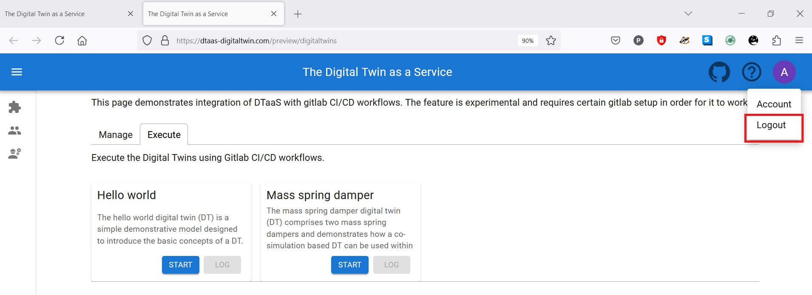

This page contains a screenshot driven preview of the website.

### Login to enter the DTaaS software platform


The screen presents with HTTP authentication form. You can enter the user credentials. You will be using HTTPS secure communication so the username and password are secure.
### Enter username again


You are now logged into the server. You can enter the same username again to log into your workspace.

### Overview of menu items

The menu is hidden by default. Only the icons of menu items are visible. You can click on the :octicons-three-bars-16: icon in the top-left corner of the page to see the menu.


There are three menu items:

**Library**: for management of reusable library assets. You can upload, download, create and modify new files on this page.

**Digital Twins**: for management of digital twins. You are presented with Jupyter Lab page from which you can run the digital twins.

**Workbench**: Not all digital twins can be managed within Jupyter Lab. You have more tools at your disposal on this page.


### Library tabs and their help text


You can see the file manager and five tabs above the library manager. Each tab provides help text to guide users in the use of different directories in their workspace.

??? Functions tip 
    The functions responsible for pre- and post-processing of: data inputs, data outputs, control outputs. The data science libraries and functions can be used to create useful function assets for the platform.

    In some cases, Digital Twin models require calibration prior to their use; functions written by domain experts along with right data inputs can make model calibration an achievable goal. Another use of functions is to process the sensor and actuator data of both Physical Twins and Digital Twins.
    ```

??? Data tip
    The data sources and sinks available to a digital twins. Typical examples of data sources are sensor measurements from  Physical Twins, and test data provided by manufacturers for calibration of models. Typical examples of data sinks are visualization software, external users and data storage services. There exist special outputs such as events, and commands which are akin to control outputs from a Digital Twin. These control outputs usually go to Physical Twins, but they can also go to another Digital Twin.

??? Models tip
    The model assets are used to describe different aspects of Physical Twins and their environment, at different levels of abstraction. Therefore, it is possible to have multiple models for the same Physical Twin. For example, a flexible robot used in a car production plant may have structural model(s) which will be useful in tracking the wear and tear of parts. The same robot can have a behavioural model(s) describing the safety guarantees provided by the robot manufacturer. The same robot can also have a functional model(s) describing the part manufacturing capabilities of the robot.

??? Tools tip
    The software tool assets are software used to create, evaluate and analyze models. These tools are executed on top of a computing platforms, i.e., an operating system, or virtual machines like Java virtual machine, or inside docker containers. The tools tend to be platform specific, making them less reusable than models. 

    A tool can be packaged to run on a local or distributed virtual machine environments thus allowing selection of most suitable execution environment for a Digital Twin. 

    Most models require tools to evaluate them in the context of data inputs. 
    There exist cases where executable packages are run as binaries in a computing environment. Each of these packages are a pre-packaged combination of models and tools put together to create a ready to use Digital Twins.

??? Digital Twins tip
    These are ready to use digital twins created by one or more users. These digital twins can be reconfigured later for specific use cases.

In addition to the five directories, there is also **common** directory in which five sub-directories exist. These sub-directories are: data, functions, models, tools and digital twins.

??? Common Assets tip
    The common directory again has four sub-directories:

    * data
    * functions
    * models
    * tools
    * digital twins
    
    The assets common to all users are placed in **common**.


The items used by more than one user are placed in **common**. The items in the **common** directory are available to all users. Further explanation of directory structure and placement of reusable assets within the the directory structure is in the [assets page](http://localhost:8000/user/servers/lib/assets.html#file-system-structure)

:fontawesome-solid-circle-info: The file manager is based on Jupyter Notebook and all the tasks you can perform in the Jupyter Notebook can be undertaken here.

### Digital Twins page


The digital twins page has three tabs and the central pane opens Jupyter Lab. There are three tabs with helpful instructions on the suggested tasks you can undertake in the **Create - Execute - Analyze** life cycle phases of digital twin. You can see more explanation on the [life cycle phases of digital twin](../digital-twins/lifecycle.md).

??? Create tip

    Create digital twins from tools provided within user workspaces. Each digital twin will have one directory. It is suggested that user provide one bash shell script to run their digital twin. Users can create the required scripts and other files from tools provided in Workbench page.

??? Execute tip

    Digital twins are executed from within user workspaces. The given bash script gets executed from digital twin directory. Terminal-based digital twins can be executed from VSCode and graphical digital twins can be executed from VNC GUI. The results of execution can be placed in the data directory.

??? Analyze tip

    The analysis of digital twins requires running of digital twin script from user workspace. The execution results placed within data directory are processed by analysis scripts and results are placed back in the data directory. These scripts can either be executed from VSCode and graphical results or can be executed from VNC GUI.

:fontawesome-solid-circle-info: The reusable assets (files) seen in the file manager are available in the Jupyter Lab. In addition, there is a git plugin installed in the Jupyter Lab using which you can link your files with the external git repositories.

### Workbench

The **workbench** page provides links to four integrated tools.


The hyperlinks open in new browser tab. The screenshots of pages opened in new browser are:


:fontawesome-solid-bug: The Terminal hyperlink does not always work reliably. If you want terminal. Please use the tools dropdown in the Jupyter Notebook.


### Finally logout



You have to close the browser in order to completely exit the DTaaS software platform.