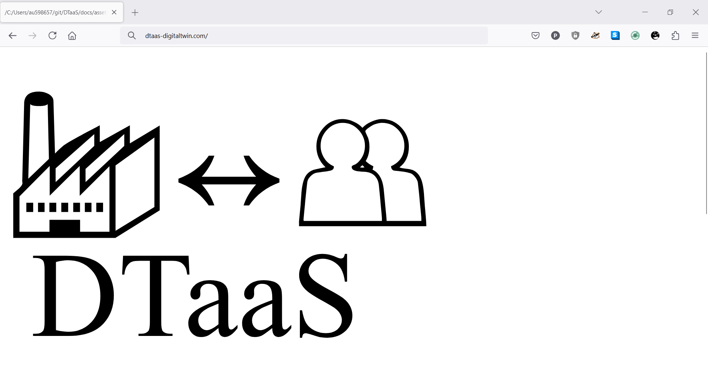
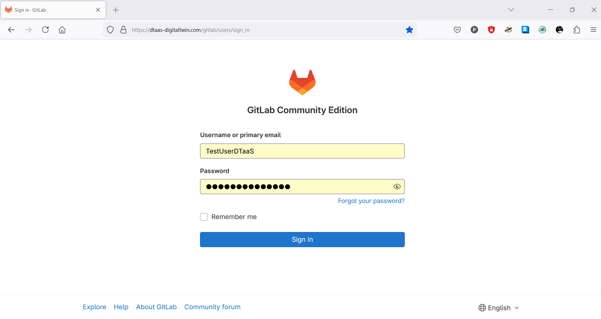
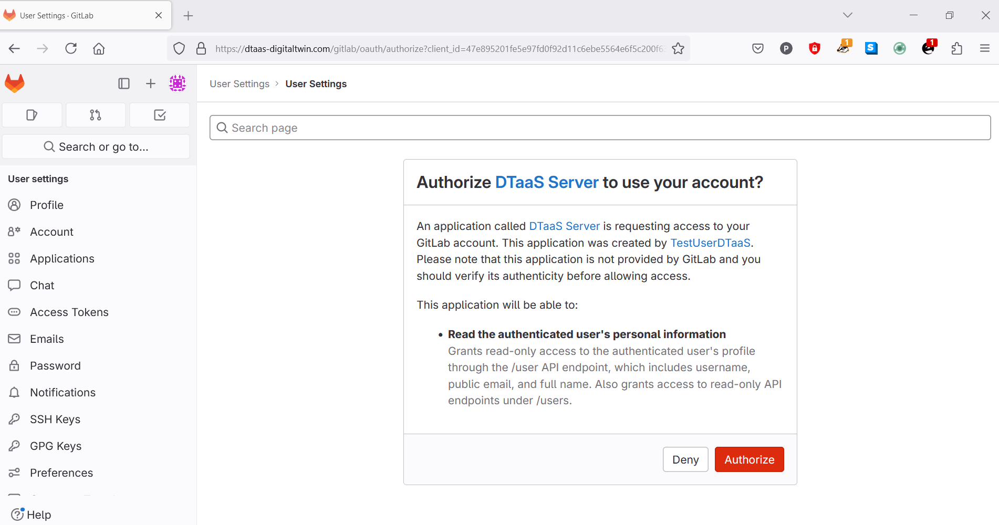
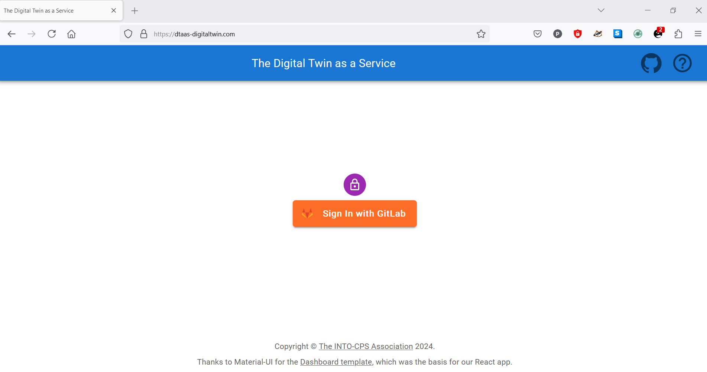
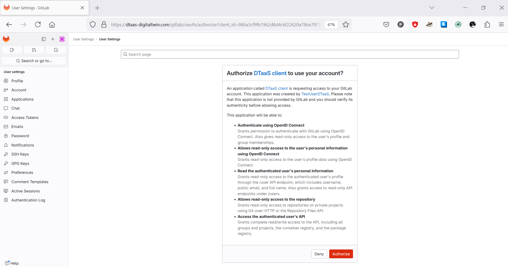

# DTaaS Website Screenshots

This page contains a screenshot driven preview of the website serving
the DTaaS software platform.

## Visit the DTaaS Application

Start off by simply visiting the website
of the DTaaS instance for which you are a user.

## Redirected to Authorization Provider

You will be redirected to the Gitlab
Authorization for DTaaS.

Enter your email/username and password.
If the email ID registered with DTaaS, is
the same as your Google Login email ID, you
can also opt to sign in using Google.

You will be redirected to the OAuth
Application page.

## Permit DTaaS Server to Use Gitlab

Click on Authorize to allow the OAuth
application to access the information
connected to your Gitlab account. This
is a necessary step.

You are now logged into the DTaaS server.
You will be redirected to the login page
of the DTaaS website.

The DTaaS website uses
an additional layer of security -
the third-party authorization
protocol known as
[OAuth](https://auth0.com/docs/get-started/authentication-and-authorization-flow/authorization-code-flow-with-pkce).
This protocol provides secure access to a DTaaS
installation if users have a working active accounts at the selected OAuth
service provider. This also uses Gitlab as OAuth provider.

You can see the Gitlab signin button. A click on this button takes you to
Gitlab instance providing authorization for DTaaS. You will not need to sign in to
Gitlab again, unless you have explicitly
logged out
of your Gitlab account.

## Permit DTaaS Website to Use Gitlab

The DTaaS website needs your permission to use your Gitlab account for
authorization. Click on **Authorize** button.

After successful authorization, you will be redirected to the **Library**
page of the DTaaS website.

There are two icons on the top-right of the webpage. The hyperlink on
**question mark icon** redirects to help page while the hyperlink on
**github icon** redirects to github code repository.

## Overview of menu items

The menu is hidden by default. Only the icons of menu items are visible.
You can click on the :octicons-three-bars-16: icon in the top-left corner
of the page to see the menu.

There are three menu items:

**Library**: for management of reusable library assets. You can upload,
download, create and modify new files on this page.

**Digital Twins**: for management of digital twins. You are presented with
the Jupyter Lab page from which you can run the digital twins.

**Workbench**: Not all digital twins can be managed within Jupyter Lab.
You have more tools at your disposal on this page.

## Library tabs and their help text

You can see five tabs each corresponding to one type of digital twin assets.
Each tab provides help text to guide users on the type of an asset.

??? tip "Functions"
    The functions responsible for pre- and post-processing of: data inputs,
    data outputs, control outputs. The data science libraries and functions
    can be used to create useful function assets for the platform.
    In some cases, Digital Twin models require calibration prior to their use;
    functions written by domain experts along with right data inputs can make
    model calibration an achievable goal. Another use of functions is to process
    the sensor and actuator data of both Physical Twins and Digital Twins.

??? tip "Data"
    The data sources and sinks available to a digital twins. Typical examples
    of data sources are sensor measurements from  Physical Twins, and
    test data provided by manufacturers for calibration of models.
    Typical examples of data sinks are visualization software, external users
    and data storage services. There exist special outputs
    such as events, and
    commands which are akin to control outputs from a Digital Twin.
    These control outputs usually go to Physical Twins, but they can also
    go to another Digital Twin.

??? tip "Models"
    The model assets are used to describe different aspects of Physical Twins
    and their environment, at different levels of abstraction. Therefore,
    it is possible to have multiple models for the same Physical Twin.
    For example, a flexible robot used in a car production plant may have
    structural model(s) which will be useful in tracking
    the wear and tear
    of parts. The same robot can have a behavioural model(s) describing
    the safety guarantees provided by the robot manufacturer. The same robot
    can also have a functional model(s) describing the part manufacturing
    capabilities of the robot.

??? tip "Tools"
    The software tool assets are software used to create, evaluate and
    analyze models. These tools are executed on top of a computing
    platforms, i.e., an operating system, or virtual machines like
    Java virtual machine, or inside docker containers. The tools tend
    to be platform specific, making them less reusable than models.
    A tool can be packaged to run on a local or distributed virtual machine
    environments thus allowing selection of most suitable execution
    environment for a Digital Twin.
    Most models require tools to evaluate them in the context of data inputs.
    There exist cases where executable packages are run as binaries in
    a computing environment. Each of these packages are a pre-packaged
    combination of models and tools put together to create a ready to
    use Digital Twins.

??? tip "Digital Twins"
    These are ready to use digital twins created by one or more users.
    These digital twins can be reconfigured later for specific use cases.

There are two sub-tabs, namely **private** and **common**. The library assets
in private category are visible only to the logged in user while the library
assets in common category are available to all the users.

Further explanation on the placement of reusable assets within each type
and the underlying directory structure on the server
is in the [assets page](../servers/lib/assets.md#file-system-structure)

!!! note
  You can upload assets (files) using the **upload** button.

:fontawesome-solid-circle-info: The file manager is based on Jupyter notebook
and all the tasks you can perform in the Jupyter Notebook can be
undertaken here.

## Digital Twins page

The digital twins page has three tabs and the central pane opens Jupyter lab.
There are three tabs with helpful instructions on the suggested tasks you can
undertake in the **Create - Execute - Analyze** life cycle phases of
digital twin. You can see more explanation on
the [life cycle phases of digital twin](../digital-twins/lifecycle.md).

??? Create tip
    Create digital twins from tools provided within user workspaces.
    Each digital twin will have one directory. It is suggested that user
    provide one bash shell script to run their digital twin. Users can
    create the required scripts and other files from tools provided in
    Workbench page.

??? Execute tip
    Digital twins are executed from within user workspaces. The given
    bash script gets executed from digital twin directory. Terminal-based
    digital twins can be executed from VSCode and graphical digital twins
    can be executed from VNC GUI. The results of execution can be placed
    in the data directory.

??? Analyze tip
    The analysis of digital twins requires running
    of digital twin script from user workspace.
    The execution results placed within data directory
    are processed by analysis scripts and results are placed
    back in the data directory. These scripts can either be
    executed from VSCode and graphical results or can be
    executed from VNC GUI.
    The analysis of digital twins requires running of digital twin script
    from user workspace. The execution results placed within data directory
    are processed by analysis scripts and results are placed back in
    the data directory. These scripts can either be executed from VSCode
    and graphical results or can be executed from VNC GUI.

:fontawesome-solid-circle-info: The reusable assets (files) seen in
the file manager are available in the Jupyter Lab. In addition, there is
a git plugin installed in the Jupyter Lab using which you can link your
files with the external git repositories.

## Workbench

The **workbench** page provides links to four integrated tools.

* Desktop
* VS Code
* Jupyter Lab
* Jupyter Notebook

The hyperlinks open in new browser tab. The screenshots of pages opened
in new browser are:

!!! tip "Terminal"
    The Terminal hyperlink does not exist on workbench page.
    If you want terminal. Please use the tools dropdown
    in the Jupyter Notebook.
    

## Digital Twins Preview Page

There is a fifth link on the Workbench page. It is **Digital Twins Preview Page**.
It is an experimental feature at the moment. Clicking on the link opens a new page
that is similar to the Digital Twins page.

There are two tabs, namely **Manage** and **Execute**.

??? Manage tip
    Read the complete description of digital twins.
    If necessary, users can delete a digital twin, removing it
    from the workspace with all its associated data. Users can
    also reconfigure the digital twin.

??? Execute tip
    Execute the Digital Twins using Gitlab CI/CD workflows.

## Finally logout

You have to close the browser in order to completely exit
the DTaaS software platform.
