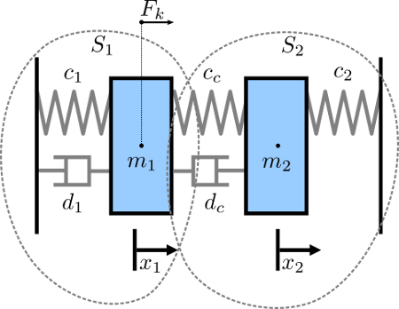
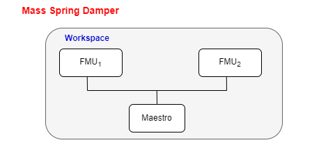
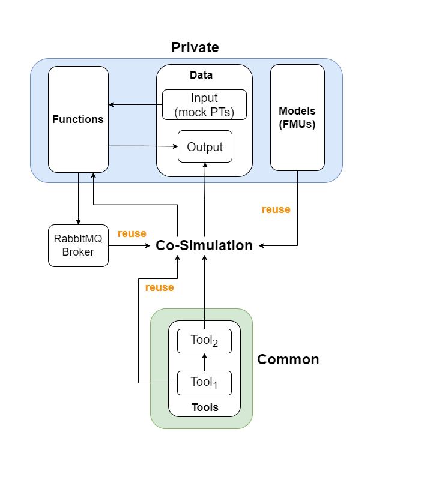

# Mass Spring Damper

## Overview
The mass spring damper study comprises two mass spring dampers and demonstrates how the sucessive substitution technique can be used to ensure that a co-simulation is stable. More information about successive substitution and other co-simulation stabilization techniques, please see [this paper](https://arxiv.org/pdf/1702.00686v1).


# Example Diagram



# Example Structure

There are two simulators included in the study, each representing a mass spring damper system. The first simulator calculates the mass displacement and speed of *m1* for a given force *Fk* acting on mass *m1*. The second simulator calculates force *Fk* given a displacement and speed of mass *m1*. By coupling these simulators, the evolution of the position of the two masses is computed.



## Configuration of assets



## Lifecycle Phases

| Lifecycle Phase    | Completed Tasks |
| -------- | ------- |
| Create  | Installs JDK    |
| Execute | Produces and stores output in data/mass-spring-damper/output directory|
| Clean   | Clears run logs and outputs |

## Run the example

To run the example, change your present directory.

```bash
cd workspace/examples/digital_twins/mass-spring-damper
```

If required, change the permission of files you need to execute, for example:

```
chmod +x lifecycle/create
```

Now, run the following scripts:

### Create

```
lifecycle/create
```

### Execute

```
lifecycle/execute
```

## Examine the results

The results can be found in the _workspace/examples/data/mass-spring-damper/output directory_. 

You can also view run logs in the _workspace/examples/digital_twins/mass-spring-damper_.
  