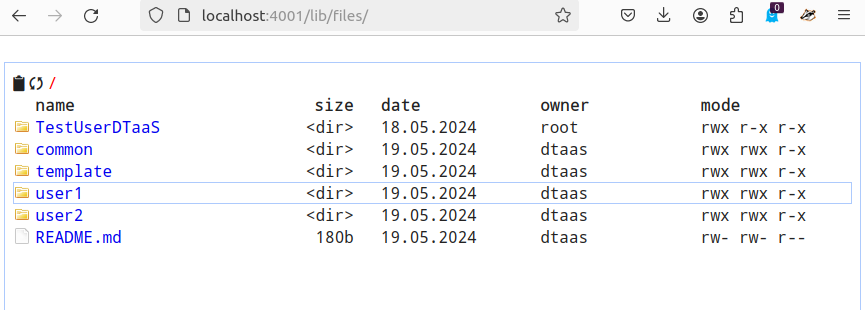

# HTTP File Server

Endpoint: `localhost:PORT/lib/files`

This option needs to be enabled with `-H http.json` flag.
If enabled, the 'localhost:PORT/lib/files' becomes available.
The regular file upload and download options become available.
Here are sample screenshots.

